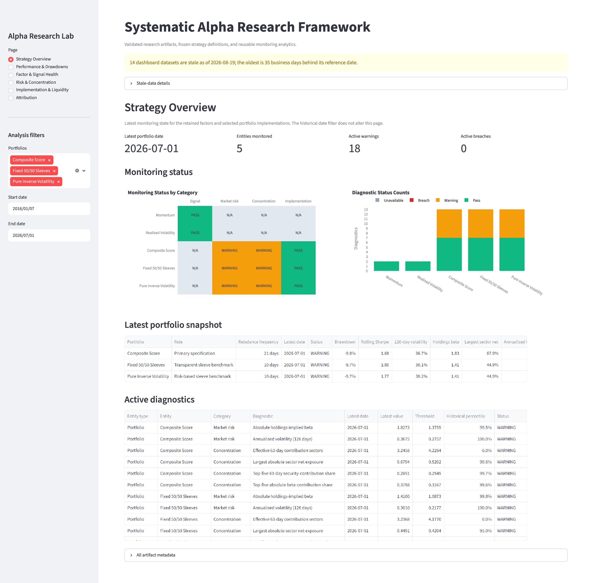
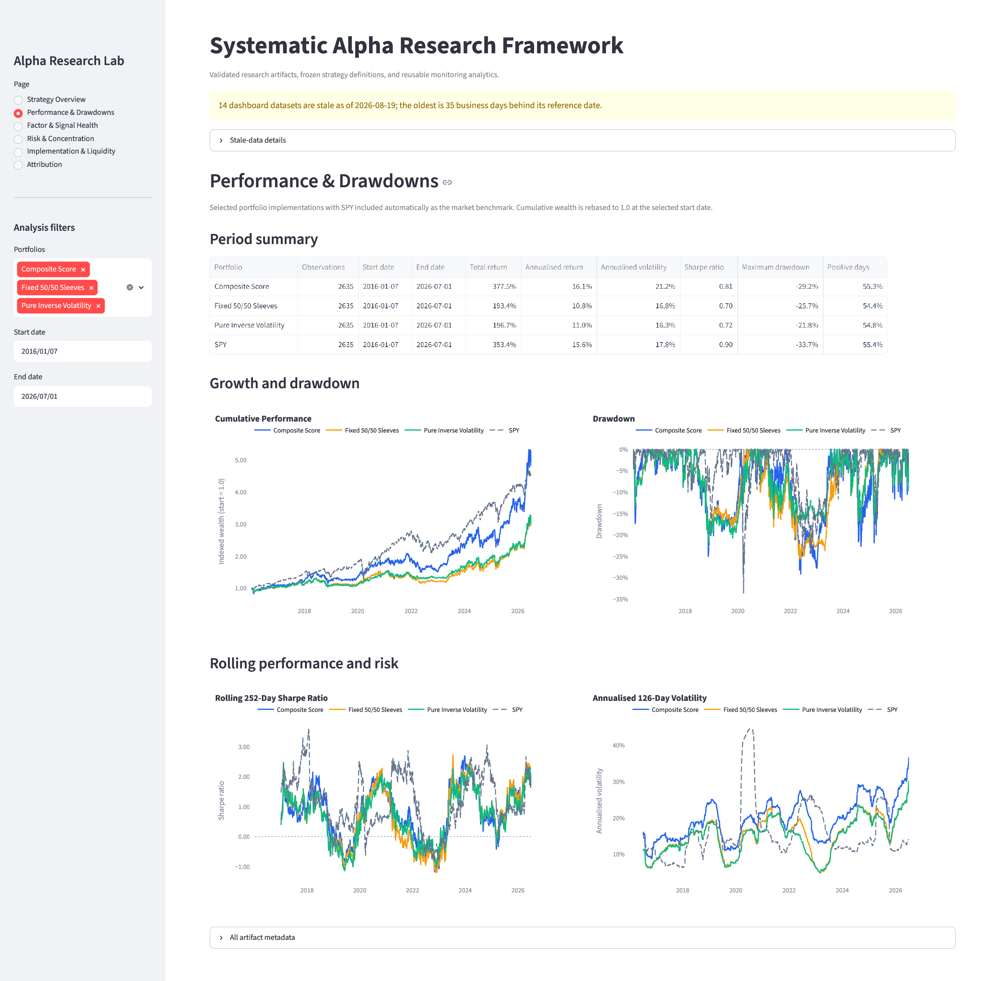
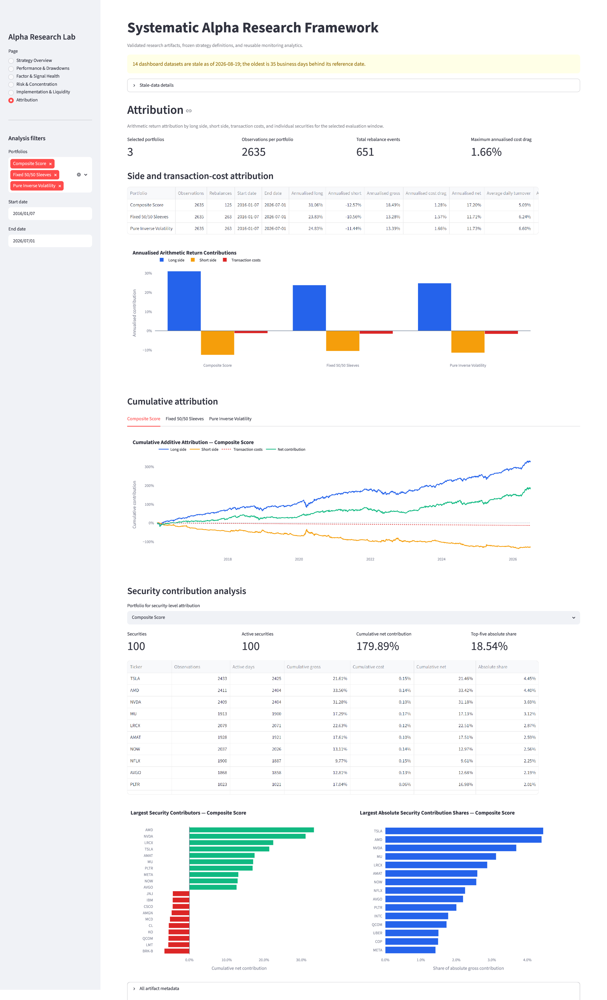

# Alpha Research Lab

An end-to-end research framework for constructing, testing, combining, attributing and monitoring systematic equity factors.

> **Project status:** the historical research workflow, reproducible artifact
> refresh, reusable analytics layer and six-page Streamlit dashboard are
> complete. A subsequent controlled single-factor benchmark challenge is also
> complete and qualifies the final interpretation without changing the frozen
> dashboard implementations. The repository-wide consistency review and final
> release validation have passed, and the project is ready for public portfolio
> presentation.

The project follows a deliberately layered workflow:

```text
Data quality
→ Factor construction
→ Signal validation
→ Portfolio backtesting
→ Multi-factor construction
→ Portfolio optimisation
→ Robustness and capacity
→ Performance and risk attribution
→ Monitoring
→ Final strategy decision
```

Notebook 10 adds a controlled post-decision challenge to this sequence. It
tests whether the component factors can falsify the initial hierarchy, then
records a qualified conclusion without rewriting the earlier evidence.

The current implementation uses daily US large-cap equity data, the present-day S&P 100 as the research universe and SPY as the market benchmark.

---

## Research objective

The project addresses a practical research question:

> How does a statistically promising factor behave after portfolio construction, transaction costs, robustness testing and systematic risk exposures are considered?

The workflow is designed to distinguish:

- predictive signal quality from portfolio performance;
- gross performance from implementable net performance;
- stock-selection effects from market and sector exposures;
- full-sample results from phase, subperiod and rolling robustness;
- nominal diversification from risk and contribution diversification; and
- useful complexity from optimisation that does not survive out of sample.

---

## Research scope

| Item | Current scope |
|---|---|
| Universe | 101 present-day S&P 100 securities |
| Equity data | 2 January 2015 to 2 July 2026 |
| Final portfolio sample | 7 January 2016 to 1 July 2026 |
| Benchmark | SPY |
| Return frequency | Daily |
| Primary forward horizon | 5 trading days for signal validation |
| Portfolio construction | Equal-weight long and short quintiles |
| Baseline transaction cost | 10 bps per unit of turnover |
| Monitored implementations | Composite Score, Fixed 50/50 Sleeves and Pure Inverse Volatility |
| Formal research benchmark | Realised Volatility Only |

The use of current index constituents introduces survivorship bias. Results are research evidence rather than production or investable performance.

---

## Retained factors

The initial factor library included:

- 12–1 month momentum;
- 3-month momentum;
- 1-month reversal; and
- 63-day realised volatility.

After predictive validation, portfolio testing and redundancy analysis, two factors were retained.

| Factor | Mean 5-day rank IC | IC t-statistic | Research role |
|---|---:|---:|---|
| 12–1 month momentum | 0.0197 | 3.65 | Complementary trend signal |
| 63-day realised volatility | 0.0253 | 4.61 | Strongest standalone portfolio signal |

Additional candidates—including idiosyncratic volatility, liquidity and risk-adjusted momentum—were investigated but not retained because they were redundant, unstable or insufficiently predictive in the current framework.

A central finding is that signal quality and portfolio quality are different. Momentum has positive cross-sectional predictive information, but its lowest-ranked securities form a weak short basket. Realised volatility translates more strongly into portfolio returns, although much of its raw performance is associated with market beta and sector exposure.

---

## Final portfolio hierarchy

### Primary implementation

**Composite Score, rebalanced every 21 trading days**

The strategy averages the processed momentum and realised-volatility scores before ranking securities. It is retained because it has:

- the highest historical return among the three monitored multi-factor candidates at their selected frequencies;
- the highest Sharpe ratio among those monitored candidates;
- the strongest transaction-cost resilience among those monitored candidates;
- positive results across all rebalance phases;
- the highest median rolling Sharpe ratio among those candidates; and
- the lowest selected-frequency average turnover among those candidates.

### Defensive alternative

**Pure Inverse Volatility, rebalanced every 10 trading days**

The strategy combines independent momentum and realised-volatility sleeves using inverse trailing sleeve volatility. It provides:

- the lowest whole-sample volatility;
- the least severe maximum drawdown;
- the strongest result during 2019–2022; and
- the best lower-tail rolling stability.

### Transparent benchmark

**Fixed 50/50 Sleeves, rebalanced every 10 trading days**

The portfolio gives equal capital allocations to the two independent factor sleeves. It remains the clearest reference for evaluating whether dynamic sleeve allocation adds value.

All final implementations use offset zero and transaction costs of 10 basis points per unit of turnover.

Notebook 10 subsequently subjects the standalone factors and all three
multi-factor portfolios to a common five-day implementation, identical dates,
complete phase and cost grids, and matched risk and implementation diagnostics.
That follow-up qualifies the hierarchy but does not alter the three frozen
dashboard implementations.

---

## Frozen monitored-implementation results

| Portfolio | Net ann. return | Ann. volatility | Sharpe | Max drawdown | Mean daily turnover |
|---|---:|---:|---:|---:|---:|
| Composite Score | 16.13% | 21.17% | 0.813 | −29.24% | 5.09% |
| Fixed 50/50 Sleeves | 10.84% | 16.77% | 0.698 | −25.68% | 6.24% |
| Pure Inverse Volatility | 10.96% | 16.25% | 0.722 | −21.77% | 6.60% |
| SPY context | 15.55% | 17.83% | 0.900 | −33.72% | — |

Composite Score slightly exceeds SPY’s annualised return but not its Sharpe ratio. SPY is a long-only contextual benchmark rather than an exposure-matched alternative.

---

## Controlled single-factor benchmark challenge

Notebook 10 tests whether the selected hierarchy survives a direct comparison
with Momentum Only and Realised Volatility Only. The primary controlled
baseline gives all five active portfolios the same dates, five-day rebalance
schedule, offset zero and 10 bps transaction cost.

| Portfolio | Net ann. return | Ann. volatility | Sharpe | Max drawdown | Mean daily turnover |
|---|---:|---:|---:|---:|---:|
| Momentum Only | 0.95% | 22.19% | 0.154 | −50.96% | 11.14% |
| Realised Volatility Only | 16.08% | 24.86% | 0.724 | −45.85% | 8.21% |
| Composite Score | 13.74% | 21.33% | 0.711 | −30.63% | 10.47% |
| Fixed 50/50 Sleeves | 10.35% | 16.84% | 0.670 | −25.66% | 8.71% |
| Pure Inverse Volatility | 10.41% | 16.29% | 0.690 | −19.57% | 9.24% |

Realised Volatility’s return, phase, cost, turnover and capacity evidence is too
strong to omit from the formal research comparison. It is therefore retained
as a standalone benchmark. It is not promoted automatically to the dashboard:
its near-market beta, larger sector tilts, long-side dependence, weak 2019–2022
result and deeper drawdown preserve a clear distinction between return
leadership and risk-controlled implementation.

Composite remains a reasonable risk-controlled multi-factor primary when that
objective is stated explicitly. Pure Inverse Volatility remains the strongest
defensive alternative. Momentum Only remains a component benchmark rather than
a strategy candidate.

---

## Robustness findings

### Rebalance phases

Every rebalance phase at the selected frequencies produces a positive annualised return and Sharpe ratio.

Composite Score’s phase-averaged results are:

- annualised return: 15.84%;
- Sharpe ratio: 0.802;
- worst-phase annualised return: 13.46%; and
- worst-phase Sharpe ratio: 0.701.

Its selected offset-zero result is close to its phase average and is therefore not driven by a favourable rebalance date.

### Transaction costs

Within the three frozen monitored candidates, the selected-frequency hierarchy
is unchanged across costs of 0, 5, 10, 20 and 50 basis points per unit of
turnover. The later common-frequency challenge separately finds that Realised
Volatility Only is the most cost-resilient five-day portfolio.

At 50 basis points, phase-averaged annualised returns remain positive:

| Portfolio | Ann. return | Sharpe |
|---|---:|---:|
| Composite Score | 10.00% | 0.556 |
| Fixed 50/50 Sleeves | 3.83% | 0.308 |
| Pure Inverse Volatility | 3.99% | 0.321 |

### Subperiods

Performance is positive but materially regime-dependent.

| Subperiod | Composite | Fixed 50/50 | Pure inverse volatility |
|---|---:|---:|---:|
| 2016–2018 | 7.65% | 3.59% | 3.05% |
| 2019–2022 | 2.86% | 1.67% | 5.32% |
| 2023–present | 41.45% | 28.56% | 26.02% |

The strong post-2022 period contributes substantially to the full-sample results. None of the strategies should be described as uniformly strong across market regimes.

### Capacity

Under a 1% maximum participation assumption, worst-phase fifth-percentile capacity is estimated at:

- Composite Score: $24.8 million;
- Fixed 50/50 Sleeves: $40.2 million; and
- Pure Inverse Volatility: $38.3 million.

These are scenario-based research estimates, not deployable capital limits.

---

## Optimisation findings

Walk-forward global minimum-variance allocation produced stable, moderate sleeve weights but did not improve materially on simpler allocations.

Maximum-Sharpe mean-variance optimisation was rejected because:

- 61.7% of allocations were boundary solutions;
- estimated and realised sleeve-return spreads were effectively uncorrelated;
- the return-ranking hit rate was 48.3%;
- MVO underperformed equal weighting by 14.3 bps per allocation period; and
- increasing MVO intensity monotonically reduced return and Sharpe while increasing turnover and drawdown.

The result illustrates a broader lesson:

> A more sophisticated allocation method is useful only when its additional estimates contain reliable information.

---

## Attribution and monitoring

The completed attribution layer covers:

- portfolio, sleeve and long/short performance;
- transaction-cost contributions;
- holdings-implied and realised market beta;
- sector exposures;
- rolling volatility and drawdowns;
- security and sector return contributions;
- position and beta-contribution concentration;
- turnover and security-level trade capacity; and
- missing-return exposure.

The latest monitoring state is **WARNING**, not **BREACH**.

As of 1 July 2026:

| Portfolio | Holdings-implied beta | 126-day volatility | Largest absolute sector net exposure |
|---|---:|---:|---:|
| Composite Score | 1.83 | 36.7% | 67.9% |
| Fixed 50/50 Sleeves | 1.41 | 30.1% | 44.9% |
| Pure Inverse Volatility | 1.41 | 30.2% | 44.9% |

Signal health and implementation diagnostics pass. The warnings arise from elevated beta, volatility and concentrated sector, beta and realised-return contributions.

The selected portfolios are long/short by capital construction, but they are not market-neutral or sector-neutral.

---

## Research and monitoring dashboard

The completed Streamlit dashboard consumes validated research artifacts rather
than notebook state. It contains six pages:

| Page | Purpose |
|---|---|
| Strategy Overview | Latest portfolio and factor statuses, active diagnostics and implementation roles |
| Performance & Drawdowns | Period performance, indexed wealth, drawdowns, rolling Sharpe and volatility |
| Factor & Signal Health | Coverage, predictive IC, rank stability and cross-factor dependence |
| Risk & Concentration | Holdings-implied beta, realised beta and position, sector and contribution concentration |
| Implementation & Liquidity | Turnover, trade size, capacity, missing-return exposure and liquidity coverage |
| Attribution | Long/short and transaction-cost attribution together with security-level contributions |

Shared sidebar controls provide:

- independent starting- and ending-date selectors;
- multi-portfolio filtering;
- a fixed set of retained strategy implementations; and
- explicit validation of invalid or empty selections.

The dashboard distinguishes structural readiness from data freshness. Missing,
unreadable or contract-invalid artifacts stop execution with explanatory
metadata. Stale but structurally valid artifacts remain available and are
identified with a warning.

The documented results and screenshots represent the frozen July 2026 research
snapshot. When those artifacts are reconstructed locally, their stale status
reflects elapsed calendar time rather than an artifact failure.

The dashboard continues to monitor the three frozen multi-factor
implementations. Realised Volatility Only is a formal research benchmark from
Notebook 10, but it is not included in the current 15-artifact dashboard bundle.

---

## Dashboard preview

### Strategy overview



### Performance and drawdowns



### Attribution



Detailed operating and reproduction instructions are available in the [dashboard and reproducibility guide](docs/dashboard_guide.md).

---

## Notebook workflow

| Notebook | Purpose |
|---|---|
| `01_data_exploration.ipynb` | Data coverage, quality and universe diagnostics |
| `02_factor_analysis.ipynb` | Factor construction and predictive validation |
| `03_backtest_analysis.ipynb` | Standalone factor backtests and exposure experiments |
| `04_portfolio_construction.ipynb` | Composite scores and independent factor sleeves |
| `05_portfolio_optimisation.ipynb` | GMV, MVO and shrinkage experiments |
| `06_portfolio_robustness.ipynb` | Frequency, costs, phases, subperiods and capacity |
| `07_performance_and_short_side_attribution.ipynb` | Performance, risk, contribution and short-side attribution |
| `08_strategy_monitoring_and_diagnostics.ipynb` | Signal, risk, concentration and implementation monitoring |
| `09_final_strategy_assessment.ipynb` | Final evidence synthesis and strategy hierarchy |
| `10_single_factor_benchmark_challenge.ipynb` | Controlled standalone-factor challenge and qualified conclusion |

---

## Project structure

```text
alpha-research-lab/
├── .github/workflows/tests.yml
├── dashboard/
│   ├── dashboard_pages.py
│   └── streamlit_app.py
├── data/
│   ├── raw/                  # generated locally; ignored by Git
│   └── processed/            # generated locally; ignored by Git
├── docs/
│   ├── images/
│   ├── dashboard_guide.md
│   ├── methodology.md
│   └── progress_report.md
├── notebooks/
│   ├── 01_data_exploration.ipynb
│   ├── 02_factor_analysis.ipynb
│   ├── 03_backtest_analysis.ipynb
│   ├── 04_portfolio_construction.ipynb
│   ├── 05_portfolio_optimisation.ipynb
│   ├── 06_portfolio_robustness.ipynb
│   ├── 07_performance_and_short_side_attribution.ipynb
│   ├── 08_strategy_monitoring_and_diagnostics.ipynb
│   ├── 09_final_strategy_assessment.ipynb
│   ├── 10_single_factor_benchmark_challenge.ipynb
│   └── experiments/
├── scripts/
│   ├── download_data.py
│   ├── build_processed_panel.py
│   ├── build_return_panel.py
│   ├── build_factor_panel.py
│   ├── run_factor_backtests.py
│   ├── build_strategy_monitoring.py
│   └── refresh_strategy_outputs.py
├── src/
│   └── alpha_research/
│       ├── config/
│       ├── artifacts.py
│       ├── attribution.py
│       ├── backtest.py
│       ├── costs.py
│       ├── dashboard_analytics.py
│       ├── dashboard_data.py
│       ├── dashboard_ui.py
│       ├── data_checks.py
│       ├── data_loader.py
│       ├── factors.py
│       ├── metrics.py
│       ├── monitoring.py
│       ├── portfolio.py
│       ├── refresh.py
│       ├── returns.py
│       ├── risk.py
│       ├── signal_processing.py
│       ├── universe.py
│       ├── validation.py
│       ├── visualisation.py
│       └── workflows.py
├── tests/
├── LICENSE
├── pyproject.toml
└── requirements.txt
```

---

## Installation

Clone the repository and create a virtual environment:

```bash
git clone https://github.com/THUdzc14/alpha-research-lab.git
cd alpha-research-lab
python -m venv .venv
```

Activate it on Windows:

```powershell
.venv\Scripts\Activate.ps1
```

Install the dependencies and editable local package:

```powershell
python -m pip install --upgrade pip
python -m pip install -r requirements.txt
python -m pip install -e .
```

Run the automated checks:

```powershell
python -m pytest
python -m ruff check src tests scripts dashboard
python -m compileall -q src dashboard scripts tests
```

---

## Reproducing the research artifacts

The public repository does not distribute downloaded market data or generated
Parquet artifacts. Build them locally from the repository root.

To request the documented date window, whose final included date is 2 July
2026, run:

```powershell
python scripts/download_data.py --start 2015-01-01 --end 2026-07-03
python scripts/build_processed_panel.py
python scripts/build_return_panel.py
python scripts/build_factor_panel.py
python scripts/run_factor_backtests.py
```

The `yfinance` end date is exclusive. Fixing it makes the requested date window
explicit, but does not preserve the historical vendor response or the S&P 100
membership retrieved at runtime. Exact recreation of the original raw snapshot
would also require the same saved constituent list and unchanged source data.

On a clean clone, create the six attribution and nine monitoring artifacts with
the explicit writing mode:

```powershell
python scripts/refresh_strategy_outputs.py --write
```

The command reconstructs all 15 dashboard datasets without executing the
notebooks, validates their contracts, writes them and validates the persisted
files again.

After artifacts exist, use dry-run mode for non-writing reconciliation:

```powershell
python scripts/refresh_strategy_outputs.py
```

Dry-run mode rebuilds the datasets in memory and compares their columns, keys
and values with the saved local Parquet files.

The refresh workflow produces:

* 6 attribution datasets;
* 9 monitoring datasets;
* cross-artifact identity and accounting validation; and
* dashboard-facing freshness metadata.

The notebooks remain the full research record, but neither artifact refresh nor
dashboard execution depends on notebook state.

---

## Running the dashboard

Launch the Streamlit application from the repository root:

```powershell
streamlit run dashboard/streamlit_app.py
```

The application loads artifacts in non-strict mode so that missing or invalid
files can be explained in the interface. Page analytics themselves operate only
after structural readiness has been established.

A stale-data warning is expected when the current date is materially later than
the frozen research snapshot. To refresh the snapshot, rerun the validated
refresh workflow rather than editing dashboard outputs manually.

---

## Research principles

The project follows several principles:

- economic interpretation should precede optimisation;
- signal validation should precede portfolio selection;
- overlapping forward returns should be treated cautiously;
- turnover and transaction costs should be included;
- long and short books should be analysed separately;
- dollar neutrality should not be confused with beta neutrality;
- nominal position counts should not be confused with risk diversification;
- robustness should be tested across phases, costs, subperiods and rolling windows;
- negative and inconclusive results should be retained;
- complexity should be accepted only when it adds realised value; and
- monitoring warnings should not automatically trigger in-sample strategy changes.

---

## Main limitations

The most important limitations are:

- use of present-day index constituents and resulting survivorship bias;
- no point-in-time sector classifications or delisting returns;
- simplified linear transaction costs;
- incomplete modelling of borrow fees, availability, recalls and financing;
- no nonlinear market-impact model;
- capacity estimates based on historical ADV and fixed participation limits;
- no explicit beta- or sector-neutrality constraint in the final portfolios;
- material dependence on the post-2022 period;
- in-sample research and model-selection effects; and
- no live, paper-trading or genuinely unseen forward evaluation.

See [`docs/methodology.md`](docs/methodology.md) for detailed assumptions.

---

## Project status and possible extensions

The research implementation, dashboard, documentation and controlled
repository-wide consistency review are complete. The full test suite, static
checks, six-page dashboard smoke validation and 15-artifact reconciliation also
passed after the revision. The controlled standalone-factor challenge is
documented as a qualification to the frozen hierarchy, with Realised Volatility
Only retained as a formal research benchmark rather than a monitored dashboard
implementation. The repository is ready for public release.

Possible later extensions include genuinely unseen forward evaluation,
paper-trading infrastructure, dashboard monitoring of the formal standalone
benchmark, scheduled refreshes and deployment. They are not requirements of the
completed historical research project.

---

## Documentation

- [`docs/methodology.md`](docs/methodology.md)
- [`docs/progress_report.md`](docs/progress_report.md)
- [`docs/dashboard_guide.md`](docs/dashboard_guide.md)

---

## Data provenance and licence

Market data are retrieved from [Yahoo Finance](https://finance.yahoo.com/)
through the independent open-source
[`yfinance`](https://github.com/ranaroussi/yfinance) library. The research
universe is based on the current S&P 100 constituent table retrieved from
[Wikipedia](https://en.wikipedia.org/wiki/S%26P_100). Users are responsible for
complying with the terms that apply to any downloaded third-party data.

Repository code and documentation are released under the [MIT License](LICENSE).
That licence does not grant rights to Yahoo Finance data, third-party trademarks
or third-party dependencies, each of which remains subject to its own terms.

---

## Disclaimer

This repository is an educational and research project. It is not investment advice, and its historical results should not be interpreted as evidence of future investment performance.
